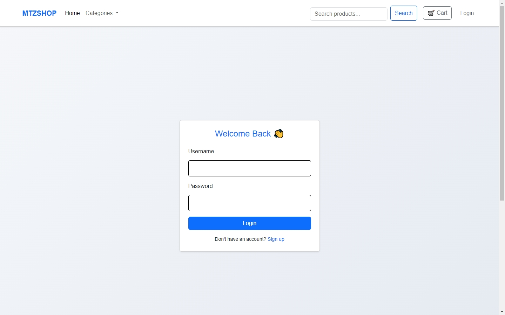
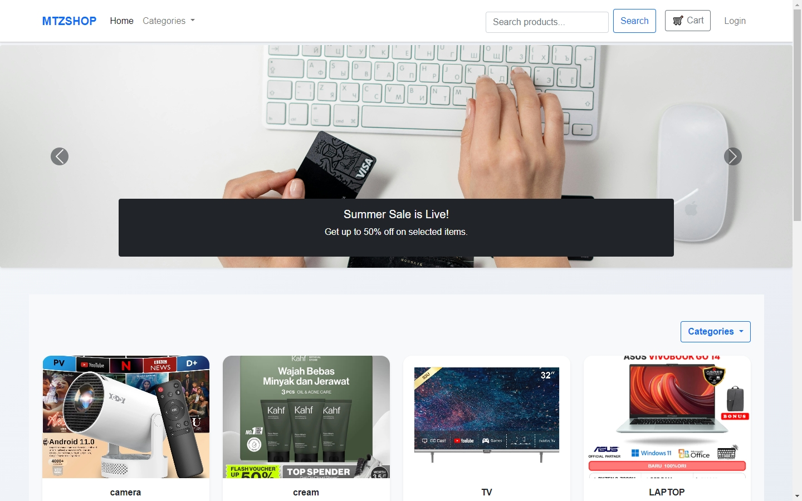
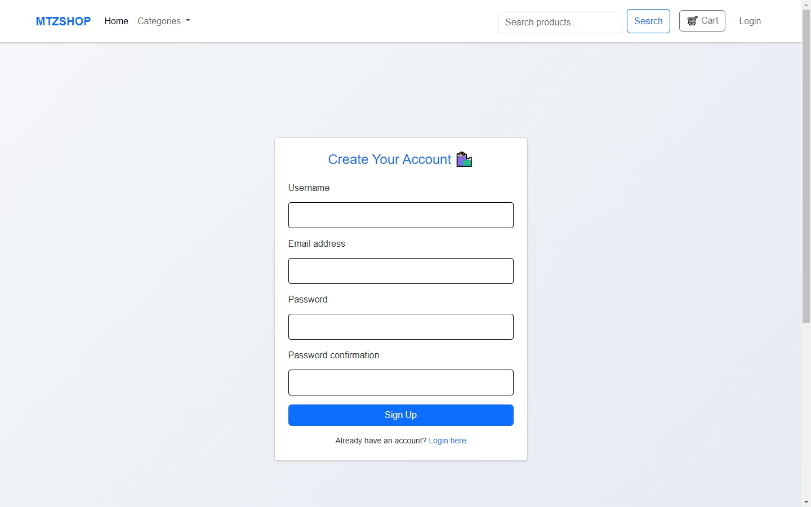
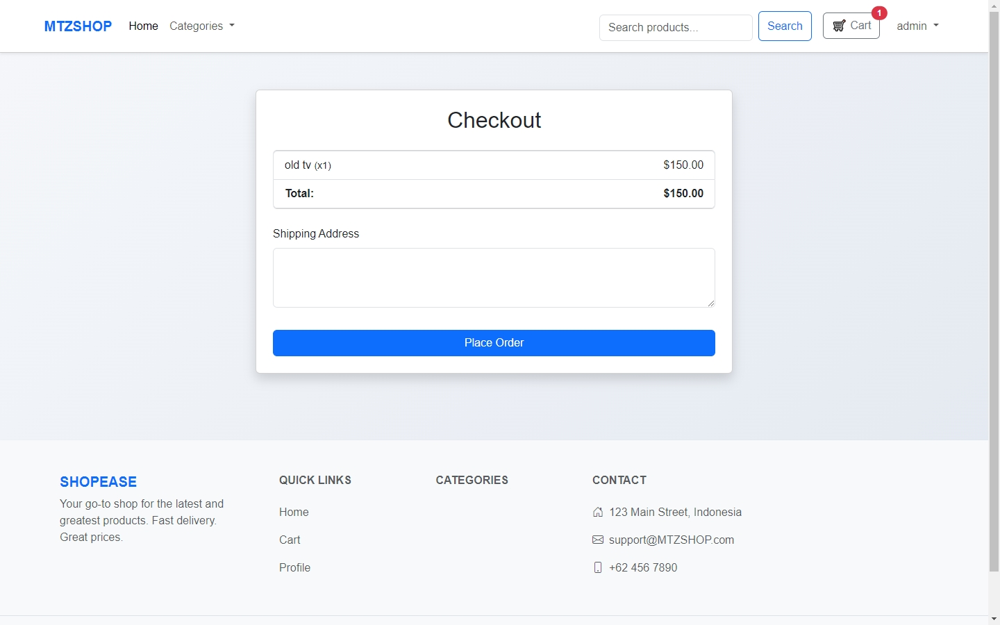

# 🛒 Django E-commerce Store

A modern and responsive e-commerce web application built with Django and Bootstrap. This project allows users to browse products, view details, manage a shopping cart, and securely log in or register.

---

## 🚀 Features

- 🖼️ Home page with carousel banner and product grid  
- 🔍 Product detail page with size/color selection  
- 🛍️ Add to cart, remove, and adjust quantity  
- 👥 User authentication (signup, login, logout)  
- 📦 Category filtering  
- 💬 Flash messages and responsive design  
- ⚙️ Admin panel for product/category management  

---

## 📸 Screenshots






---

## 🧰 Technologies Used

- Python 3.x
- Django 4.x
- Bootstrap 5
- SQLite (default Django DB)
- HTML5 / CSS3 / JavaScript (Bootstrap components)

---

## 📦 Installation

1. **Clone the repo**

```bash
git clone https://github.com/moatazbenma/fullstack-projects.git
cd django-commerce
