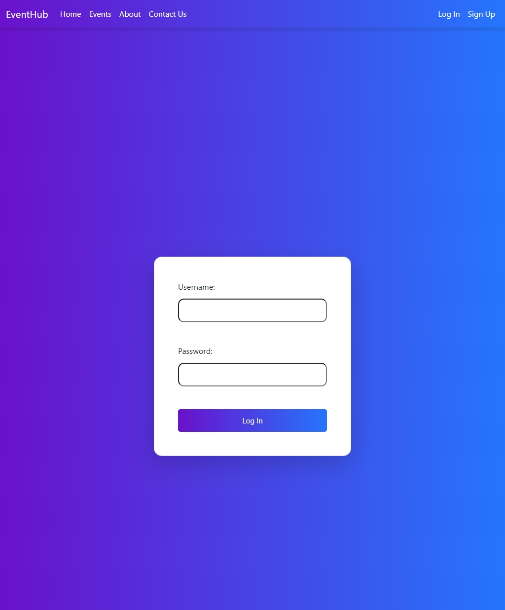
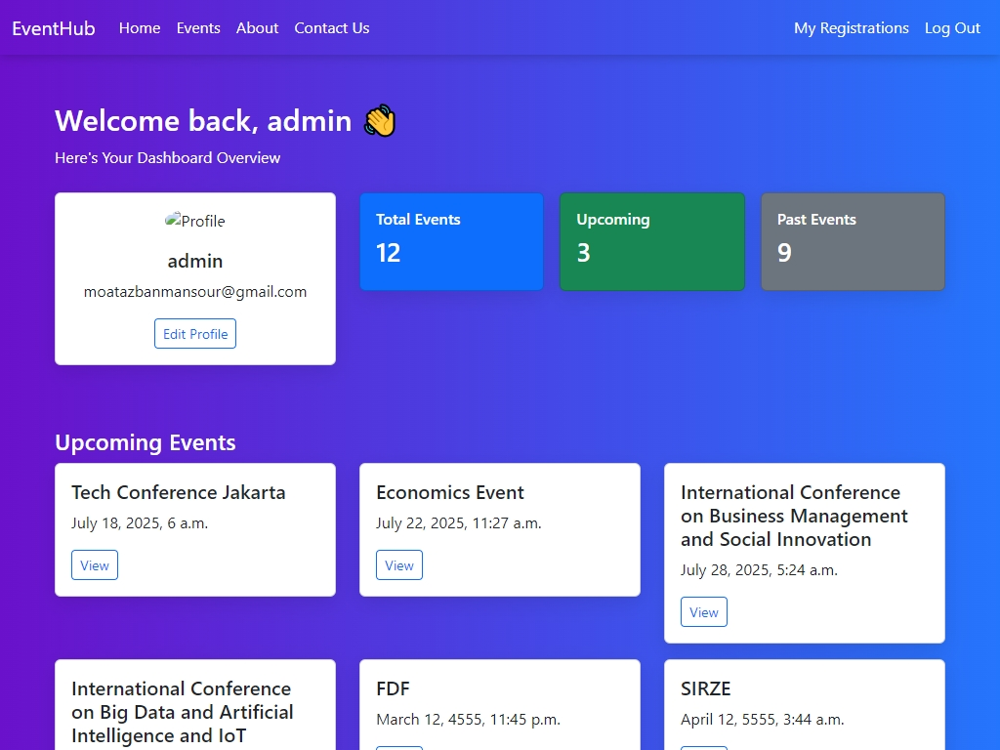
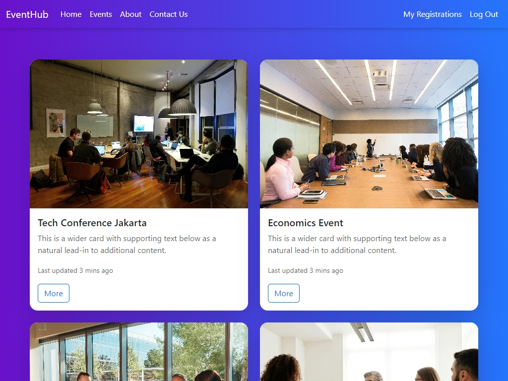
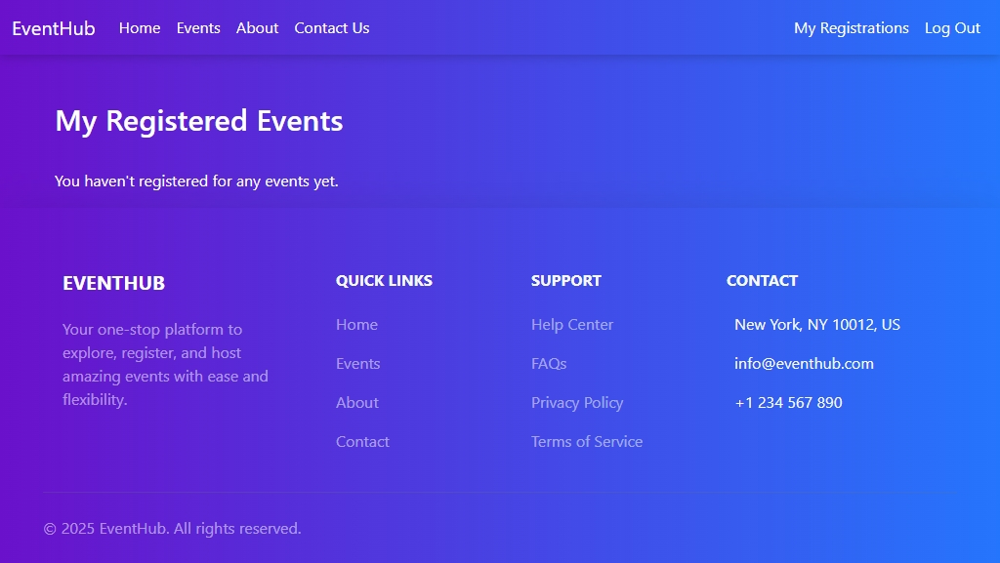
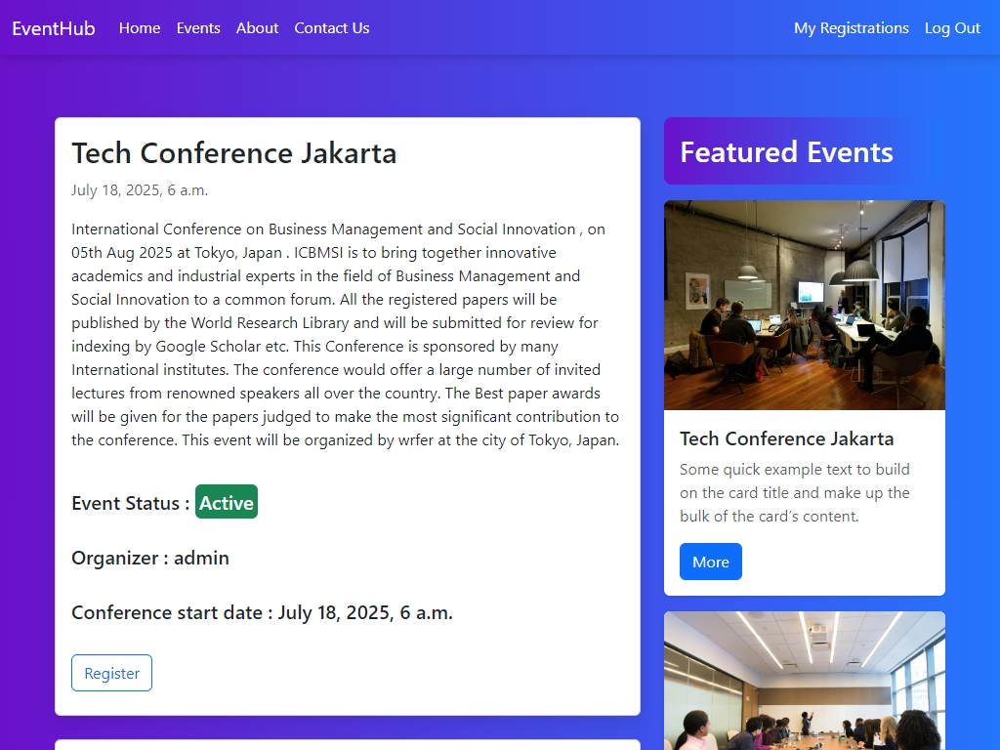
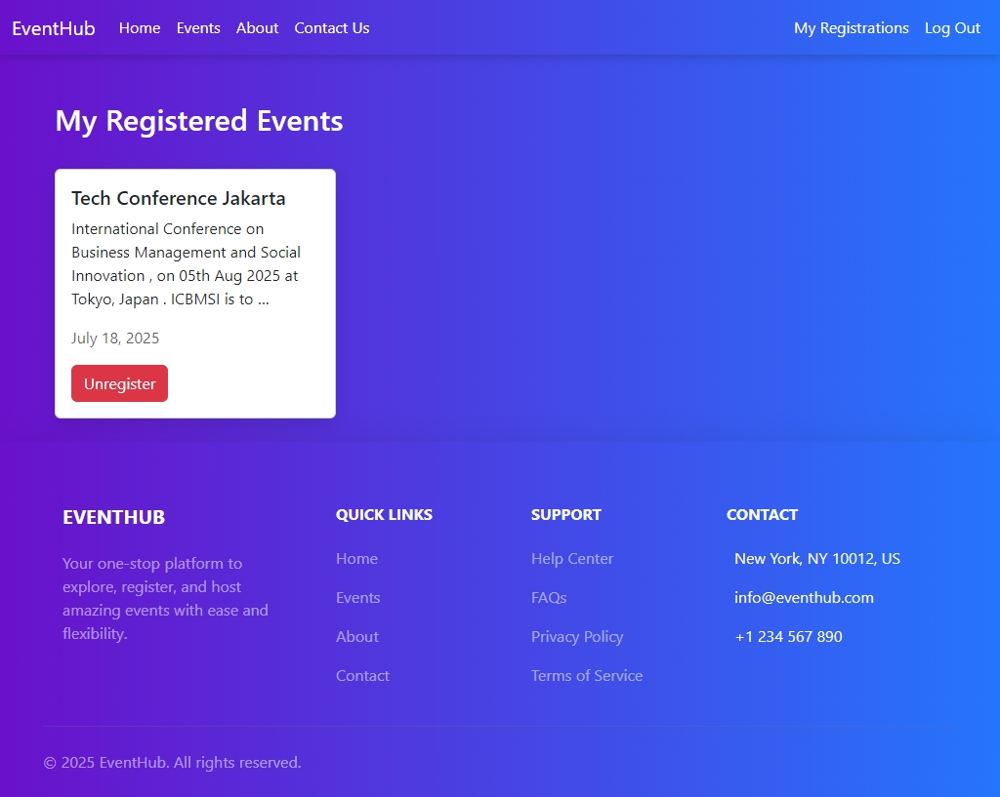

# 🎉 Event Management Platform (Django)

A full-featured Django web application for managing events. Users can register, log in, create events (as organizers), register for events (as attendees), and manage their profiles — including uploading a profile picture.

---

## ✨ Features

- 🔐 User Authentication (Sign up, Log in, Log out)
- 🧑‍💼 Organizer and Attendee roles (with same user account)
- 🗕 Create, View, and Manage Events
- 🖼️ Upload Event Images
- ✅ Register for Events
- 👤 Edit Profile with Profile Picture Upload
- 💻 Responsive UI with Bootstrap

---

## 🛠️ Technologies Used

- **Backend:** Django (Python)
- **Frontend:** HTML, Bootstrap 5
- **Database:** SQLite (default for development)
- **Media:** Django File Uploads for images:
- 
- 
- 
- 
- 
- 

---

## 📦 Installation

### 1. Clone the Repository

```bash
git clone https://github.com/moatazbenma/fullstack-projects.git
cd fullstack-projects
cd django-events


Let me know if you'd like this customized for deployment (e.g. on Heroku or Render) or team collaboration.


